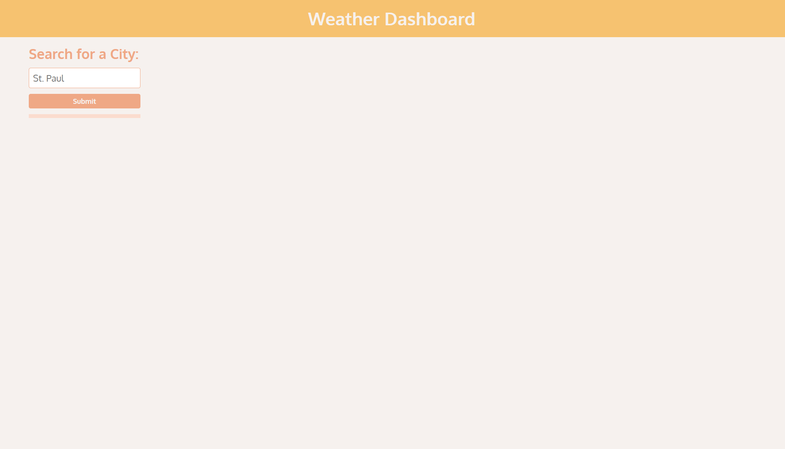
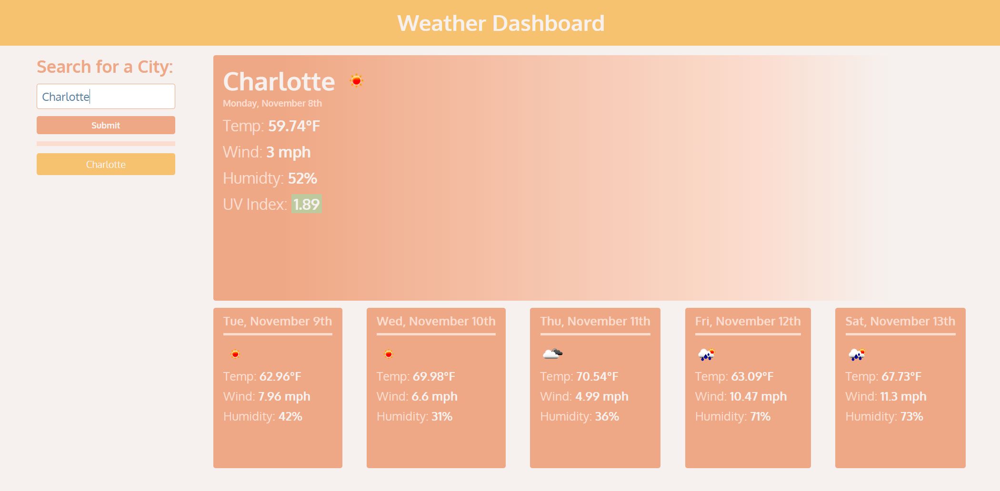

# Weather Dashboard
Weather Dashboard is an application that shows a user both a current forecast and a five day forecast of a specified city. While using this application, the users search history will be saved on the page as well. This is for the sake of not requiring the user to search for certain cities of interest multiple times if they want to use this application continuously.

In order to recieve weather data, store the users search history, and display the correct days, I used the following tools:
* OpenWeatherMap API
* localStorage Web API
* Moment.js

Upon opening the application, which you can do [here](https://adairconlin.art/weather-dashboard/), the user will be able to search for a city before any information is loaded onto the page.

After searching for a city, the OpenWeatherMap API will be called in order to search and sort the correct parameters and return them to the HTML elements for the user to see. The city that the user searched will also be stored locally in their browser, so the cities they want to stay informed about will persist on the page. If the user wishes to see the weather from a city that they have searched previously, they can select that city from the list on the left.

The application also highlights the UV Index either green, orange, or red to indicate whether the UV Index is favorable, moderate, or severe.

